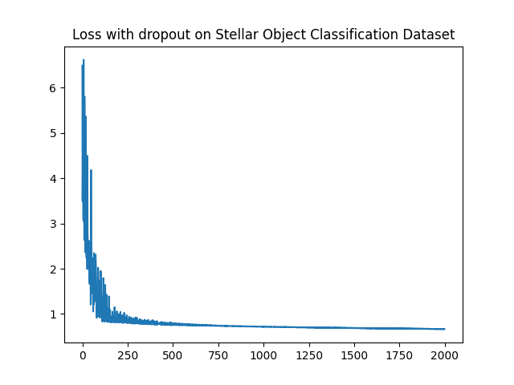
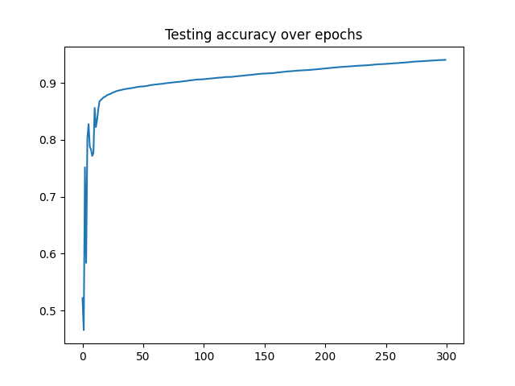
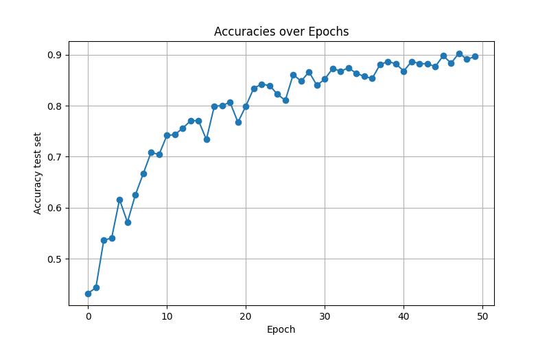
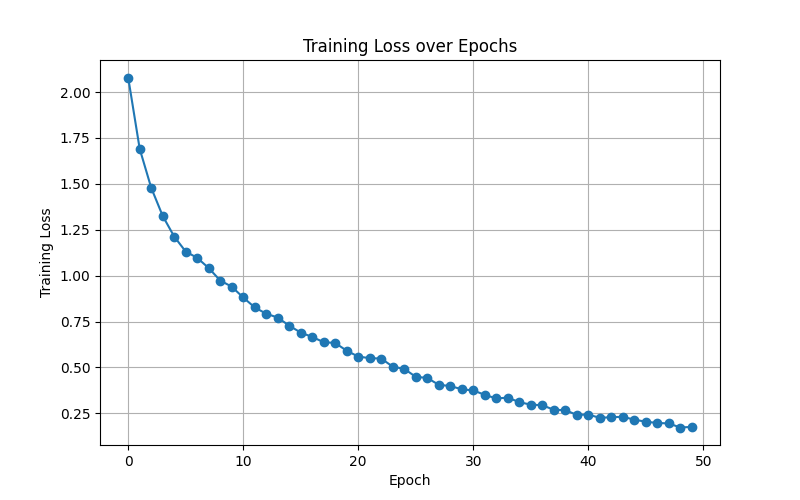

# Deep Learning from First Principles — NumPy Engine & PyTorch CNN

> MSc Artificial Intelligence · *Programming and Mathematics for AI* (INM702) final assessment.
> Two end‑to‑end deep‑learning projects: **(1)** a fully‑vectorised neural‑network engine built from scratch in **NumPy** (no autograd, hand‑derived backpropagation), and **(2)** an image‑classification pipeline in **PyTorch** benchmarking an MLP against a custom **CNN**.

<p align="left">
  
  
  
  
  
</p>

---

## Why this repository is worth a look

This project deliberately re‑implements the core machinery of deep learning **twice**, at two levels of abstraction, to demonstrate that the maths behind modern frameworks is understood — not just the API:

| | **Task 1 — NumPy engine** | **Task 2 — PyTorch pipeline** |
|---|---|---|
| **Goal** | Build a configurable deep neural network *from scratch* | Engineer a competitive image classifier |
| **Key skill** | Hand‑derived forward/backprop, optimisation maths | Framework fluency, CNN design, GPU training |
| **Dataset** | SDSS DR18 — stellar object classification (~100k rows, 3 classes) | SkyView — aerial landscapes (12,000 images, 15 classes) |
| **Headline result** | **~85% test accuracy** (mini‑batch GD) | **~89% test accuracy** (custom CNN) |

Everything is reproducible — a global seed of `42` is set across `random`, `numpy` and `torch`.

---

## Table of contents

- [Task 1 — A neural network from scratch (NumPy)](#task-1--a-neural-network-from-scratch-numpy)
- [Task 2 — Image classification with PyTorch](#task-2--image-classification-with-pytorch)
- [Results at a glance](#results-at-a-glance)
- [Repository structure](#repository-structure)
- [Getting started & reproducing results](#getting-started--reproducing-results)
- [Skills demonstrated](#skills-demonstrated)

---

## Task 1 — A neural network from scratch (NumPy)

A single, configurable `NeuralNetwork` class (`src/dev_task1/deep_nn.py`) implements the full training loop with **no deep‑learning framework** — every gradient is derived by hand and vectorised with NumPy.

### What's implemented

- **Arbitrary architecture** — pass any list of layer widths, e.g. `[n_features, 32, 16, n_classes]`.
- **Forward pass** with cached activations for backprop.
- **Hand‑derived backpropagation** — the chain rule implemented layer‑by‑layer, with the standard `dZ = A − Y` simplification at the output for softmax/sigmoid + cross‑entropy.
- **Activation functions** (`dnn_functions.py`): ReLU, Sigmoid, and a **numerically‑stable Softmax** (max‑subtraction trick to avoid `exp` overflow).
- **Loss functions**: Binary Cross‑Entropy, Categorical Cross‑Entropy, MSE — all with an `epsilon` guard against `log(0)` → `NaN`.
- **Regularisation**: L1, L2 (or both), applied consistently in *both* the loss and the weight gradients.
- **Inverted dropout** — masks generated in the forward pass and re‑applied during backprop, scaled so inference needs no change.
- **Optimisers**: vanilla gradient descent, **momentum**, and **mini‑batch gradient descent** with reproducible shuffling.
- **Evaluation utilities**: accuracy tracking per epoch, prediction, and confusion‑matrix construction.

### Engineering notes that mattered

- **Class imbalance** in SDSS DR18 (GALAXY 52k / STAR 37k / QSO 10k) was identified as the cause of a deceptively high initial accuracy — addressed and documented rather than ignored.
- **Mini‑batch GD was a step‑change**: switching from full‑batch to mini‑batches lifted test accuracy from ~0.77 to ~0.85 while training faster — a concrete demonstration of optimisation intuition, captured in the experiment log.
- Every hyperparameter sweep (architecture, learning rate, dropout, regularisation, optimiser, batch size) was logged with loss, train/test accuracy and wall‑clock time to `hyperparameter_tuning_results.xlsx`.

<p align="center">
  
  
</p>

---

## Task 2 — Image classification with PyTorch

`src/dev_task2/pytorch_nn_dev.py` builds and benchmarks two models on the **SkyView Aerial Landscape** dataset — 15 categories (Agriculture, Airport, Beach, City, Desert, Forest, …), 800 images each, 256×256 RGB.

### The experiment: MLP baseline → CNN

| Model | Architecture | Test accuracy |
|---|---|---|
| **MLP baseline** | `Flatten → 512 → 512 → 15` (fully connected) | ~0.34 |
| **CNN (final)** | 4–5 conv blocks + dropout + adaptive avg‑pool | **~0.89** |

The fully‑connected baseline exposed the core problem — *flattening a 196,608‑pixel image into a dense layer produces an enormous, slow, weak model*. The CNN was then built up incrementally, with each design decision justified by measured loss/accuracy/time:

- **Convolutional feature extractor** — stacked `Conv2d → ReLU → MaxPool2d` blocks (32 → 64 → 128 → 256 channels) with padding to preserve spatial dimensions.
- **`AdaptiveAvgPool2d`** to collapse feature maps to a fixed size, decoupling the classifier head from input resolution and slashing parameter count.
- **Dropout (0.5)** in the classifier head — the single change that pushed accuracy from ~0.75 to ~0.78, and a key ingredient in reaching ~0.89.
- **Adam** optimiser with explicit `betas`/`eps`; tuning these alone cut training time by ~5.5 minutes at equal accuracy.

### Production‑minded practices

- **Correct data handling** — transforms applied *after* the train/test split (via `ImageFolder` + `random_split` with a seeded generator) to avoid leakage.
- **Efficient input pipeline** — `DataLoader` with batching, shuffling and parallel workers feeding the GPU.
- **GPU‑aware** — automatic CUDA detection with a clean CPU fallback; metrics via `torchmetrics`.
- **Honest evaluation** — observed that lower training loss did *not* always mean higher test accuracy (over‑fitting), and selected the model accordingly rather than chasing the loss curve.

<p align="center">
  
  
</p>

---

## Results at a glance

| Task | Dataset | Best model | Test accuracy |
|------|---------|-----------|:-------------:|
| 1 — NumPy NN from scratch | SDSS DR18 (3 classes) | Mini‑batch GD MLP | **~85%** |
| 2 — PyTorch | SkyView Aerial (15 classes) | Custom CNN | **~89%** |
| 2 — PyTorch (baseline) | SkyView Aerial (15 classes) | Dense MLP | ~34% |

Full per‑experiment logs for Task 1 live in [`hyperparameter_tuning_results.xlsx`](hyperparameter_tuning_results.xlsx); the complete write‑up is in [`DOCX/INM702_Assessment_Report.pdf`](DOCX/INM702_Assessment_Report.pdf).

---

## Repository structure

```
.
├── src/
│   ├── dev_task1/                 # Task 1 — NumPy neural-network engine
│   │   ├── deep_nn.py             # Configurable NeuralNetwork class (fwd/backprop/optim)
│   │   ├── dnn_functions.py       # Activations, losses, plotting helpers
│   │   ├── preprocessing.py       # SDSS DR18 load / clean / scale / split
│   │   └── dnn_tests.py           # Unit tests + hyperparameter sweeps
│   └── dev_task2/                 # Task 2 — PyTorch image classification
│       ├── pytorch_nn_dev.py      # MLP & CNN models, training/eval loops
│       └── preprocessing.py       # ImageFolder → transforms → DataLoader
├── dataset/
│   ├── Stellar_object_classification/SDSS_DR18.csv
│   └── Aerial_Landscapes/         # 15 classes × 800 images (256×256)
├── images_task1_numpy_nn/         # Task 1 result plots
├── images_task2_pytorch_cnn/      # Task 2 result plots
├── DOCX/INM702_Assessment_Report.pdf
└── hyperparameter_tuning_results.xlsx
```

---

## Getting started & reproducing results

```bash
# 1. Clone
git clone https://github.com/BrunoSantome/Programming_math_Ai_Assessmment_Msc_Ai.git
cd Programming_math_Ai_Assessmment_Msc_Ai

# 2. Install dependencies
pip install numpy pandas scikit-learn matplotlib torch torchvision torchmetrics openpyxl

# 3. Point the loaders at your local data
#    Edit the PATH variable at the top of:
#      src/dev_task1/preprocessing.py   (SDSS_DR18.csv)
#      src/dev_task2/preprocessing.py   (Aerial_Landscapes/ folder)
```

**Run Task 1** (NumPy network + hyperparameter sweep):

```bash
cd src/dev_task1
python dnn_tests.py
```

**Run Task 2** (PyTorch CNN — GPU recommended):

```bash
cd src/dev_task2
python pytorch_nn_dev.py
```

> **Datasets** — Task 1's SDSS DR18 CSV is bundled in the repo; just repoint the `PATH`
> in `src/dev_task1/preprocessing.py` to your local copy. The Task 2 SkyView dataset is
> also included, and can otherwise be downloaded from Kaggle and linked via the `PATH`
> in `src/dev_task2/preprocessing.py`:
> <https://www.kaggle.com/datasets/ankit1743/skyview-an-aerial-landscape-dataset>
>
> A seed of `42` is fixed throughout for reproducibility.

---

## Skills demonstrated

- **Deep‑learning fundamentals** — forward/backpropagation derived and implemented by hand, not via autograd.
- **Numerical computing** — fully vectorised NumPy, numerical‑stability fixes (stable softmax, `epsilon` log guards).
- **Optimisation** — gradient descent, momentum, mini‑batch training, L1/L2 regularisation, inverted dropout.
- **PyTorch** — custom `nn.Module` models, CNN architecture design, `DataLoader` pipelines, CUDA training, `torchmetrics`.
- **ML engineering** — leakage‑free preprocessing, class‑imbalance diagnosis, systematic & logged hyperparameter tuning, over‑fitting awareness.
- **Software practice** — modular, documented code with a clear separation of data, models and experiments.
